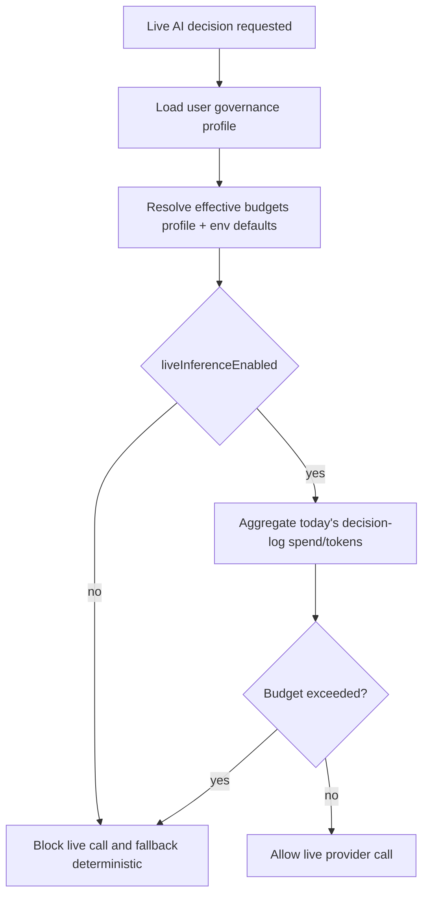

# Agents Module

This module manages strategy execution cycles for autonomous trading agents.

## Runtime flow (current)

```mermaid
flowchart TD
  A[Cron tick every minute] --> B[Fetch RUNNING agents]
  B --> C[Queue execute-strategy job per agent]
  C --> D[Validate capital / positions / max trades/day]
  D --> E[Fetch live quotes via broker connection]
  E --> F[Generate decision (AI or rule-based)]
  F --> G{confidence >= threshold}
  G -->|no| H[Log and skip]
  G -->|yes| I{autoTrade && !paperTrading}
  I -->|no| J[Log simulated/disabled]
  I -->|yes| K[Execute market order via trading queue]
```

## Guardrails added

- Enforces `maxPositions` and `maxTradesPerDay`.
- Optional strategy config guardrails:
  - `maxDailyLoss`
  - `maxDailyProfit`
- Uses live broker quotes for decision inputs.
- Blocks live placement if:
  - agent is `paperTrading=true` (paper orders are simulated and stored as trades),
  - or `autoTrade=false`,
  - or quote/LTP is missing.

## AI provider abstraction (baseline)

- Added provider registry with deterministic adapters:
  - `openai`
  - `anthropic`
  - `heuristic` fallback
- Provider selection sources (in order):
  1. strategy configuration `aiProvider`
  2. agent model config provider
  3. agent model name prefix (`provider:model`)
  4. fallback `heuristic`
- Every decision now includes provider metadata for traceability.
- Optional live provider inference is supported when:
  - `aiLiveMode` is enabled in strategy/model config
  - provider API key is configured in environment.
- Live mode has retry + timeout and deterministic fallback on failures.
- Live mode is additionally governed by budget policies:
  - `AI_DAILY_COST_BUDGET_USD`
  - `AI_DAILY_TOKEN_BUDGET`
  - `AI_PROVIDER_DAILY_COST_BUDGET_USD`
  - policy violations block live mode and force deterministic fallback.
- Every strategy cycle persists AI decision logs (`ai_decision_logs`) with provider/mode/model/action/confidence/tokens/cost metadata.
- API endpoint for audit-style review:
  - `GET /api/v1/agents/:id/decision-logs?limit=100`
  - `GET /api/v1/agents/governance/summary?days=30`
  - `GET /api/v1/agents/governance/ledger?days=30`
  - `GET /api/v1/agents/governance/policy`
  - `GET /api/v1/agents/governance/events?limit=50`
  - `PATCH /api/v1/agents/governance/policy`
- Hourly ledger rebuild scheduler aggregates daily AI usage/cost:
  - `AI_COST_LEDGER_SCHEDULER_ENABLED=true`

## Remaining limitation

- Full policy governance is still evolving (current controls include profile-managed daily budget thresholds, but not organization-wide approval workflows).
- Governance event trail is now persisted for live-policy allow/block outcomes.

## AI runtime configuration

- `AI_PROVIDER_TIMEOUT_MS` (default `4000`)
- `OPENAI_API_KEY` (optional)
- `OPENAI_ESTIMATED_COST_USD_PER_1K_TOKENS` (optional, default `0.002`)
- `ANTHROPIC_API_KEY` (optional)
- `ANTHROPIC_ESTIMATED_COST_USD_PER_1K_TOKENS` (optional, default `0.0025`)
- `AI_DAILY_COST_BUDGET_USD` (optional, default `0` disabled)
- `AI_DAILY_TOKEN_BUDGET` (optional, default `0` disabled)
- `AI_PROVIDER_DAILY_COST_BUDGET_USD` (optional, default `0` disabled)

## Governance policy flow


