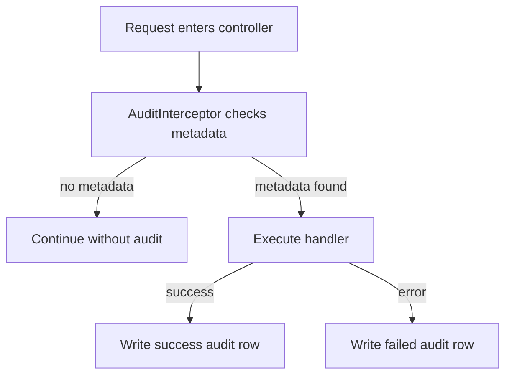

# Audit Module

Audit module captures security-sensitive user actions in immutable log records.

## Scope

- Captures decorated controller actions using `@Audit(...)`
- Stores:
  - actor (`userId`)
  - action name
  - resource type/id (when available from route params)
  - status (`success` / `failed`)
  - request context (ip, user-agent, method/path/status)

## Flow



## Usage

Decorate a route handler:

```ts
@Audit({ action: 'trade.execute', resourceType: 'trade' })
@Post()
executeTrade() {}
```

## API

- `GET /api/v1/audit/logs?limit=50` -> user-scoped audit logs
