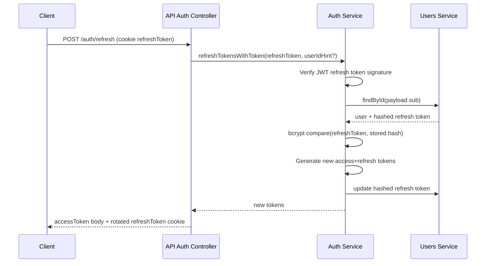

# Auth Module

Authentication uses JWT access tokens plus refresh tokens with hashed persistence.

## Current security model

- Access token returned in response body.
- Refresh token:
  - stored hashed in DB,
  - issued as `httpOnly` cookie (`refreshToken`) on login/register/refresh,
  - rotated on each refresh.
- Legacy refresh body payload remains supported for compatibility.

## Refresh flow

## Cookie settings

- `httpOnly: true`
- `sameSite: 'lax'`
- `secure: true` in production
- path: `/`

## Frontend note

Frontend should avoid persisting refresh token in browser storage and rely on cookie-based rotation.
