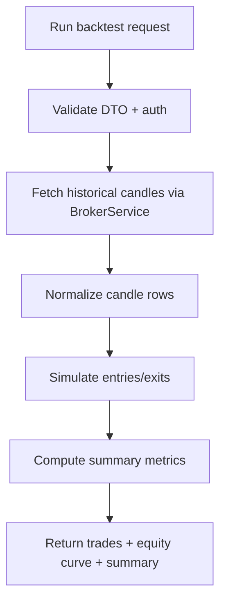

# Backtesting Module (v1)

Backtesting module provides a first production-safe historical simulation pipeline.

## Endpoint

- `POST /api/v1/backtesting/run`

## Inputs

- `connectionId` (user-owned broker connection)
- `instrumentToken`
- `interval`
- `fromDate`, `toDate`
- optional strategy tuning:
  - `entryThresholdPercent`
  - `exitThresholdPercent`
  - `quantity`
  - `feePerTrade`

## Simulation model (v1)

- Fetches historical candles from broker API.
- Uses threshold-based momentum/reversal entries.
- Supports long and short simulated positions.
- Computes net PnL and max drawdown.

## Flow

## Notes

- This is intentionally deterministic and lightweight.
- Future versions should add slippage, market impact, multi-position handling, and richer strategy DSL support.
