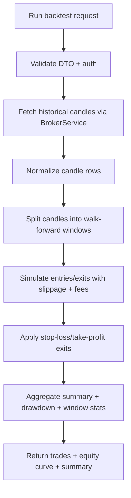
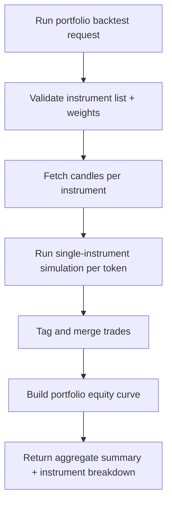

# Backtesting Module (v1.5)

Backtesting module provides a first production-safe historical simulation pipeline.

## Endpoint

- `POST /api/v1/backtesting/run`
- `POST /api/v1/backtesting/run-portfolio`

## Inputs

- `connectionId` (user-owned broker connection)
- `instrumentToken` (single-instrument endpoint)
- `instrumentTokens[]` (portfolio endpoint)
- `interval`
- `fromDate`, `toDate`
- optional strategy tuning:
  - `entryThresholdPercent`
  - `exitThresholdPercent`
  - `quantity`
  - `feePerTrade`
  - `slippageBps`
  - `stopLossPercent`
  - `takeProfitPercent`
  - `walkForwardWindows`
  - `initialCapital`

## Simulation model (v1.5)

- Fetches historical candles from broker API.
- Uses threshold-based momentum/reversal entries.
- Supports long and short simulated positions.
- Applies configurable slippage and fixed per-trade cost.
- Applies optional stop-loss and take-profit constraints.
- Supports walk-forward style segmented runs over multiple windows.
- Computes net PnL, ending equity, max drawdown, and per-window summaries.
- Portfolio endpoint aggregates multi-instrument PnL and portfolio equity curve.

## Flow

## Portfolio flow

## Notes

- This remains deterministic and intentionally lightweight.
- Future versions should add market impact models, portfolio-level allocation, and richer strategy DSL support.
