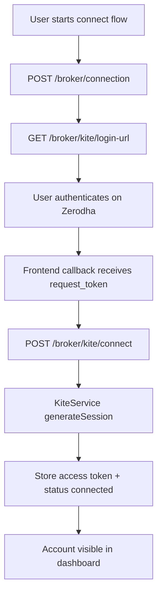

# Broker Module (Zerodha Kite)

This module owns broker account connectivity and broker-facing operations.

## Responsibilities

- Create/list/delete broker connections per user
- Exchange Kite `request_token` for `access_token`
- Fetch account profile/positions/holdings/margins
- Place broker orders
- Enforce ownership checks for all connection-scoped operations

## Security controls implemented

1. **User ownership checks**
   - Connection-scoped APIs always resolve by `{ connectionId, userId }`.
   - Unknown or cross-user IDs return `NotFoundException`.
2. **Improved Kite request handling**
   - Session generation now uses form-encoded payload for `/session/token`.
   - Authorization header format uses `token api_key:access_token`.
3. **Operational logging**
   - Each Kite error is normalized with status + safe message.
   - Error payload details are logged for debugging.

## OAuth connect flow

## Key API contracts

- `POST /broker/connection` -> `CreateConnectionDto`
- `GET /broker/kite/login-url` -> `GetKiteLoginUrlDto`
- `POST /broker/kite/connect` -> `ConnectKiteDto`
- `POST /broker/kite/order/:connectionId` -> `PlaceKiteOrderDto`

## Notes

- `apiSecret` is used only at token-exchange time and should never be persisted.
- Access token expiry handling should be expanded with proactive refresh/re-auth UX.
