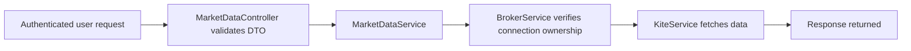

# Market Data Module

This module serves quote/OHLC/historical data through authenticated user connections.

## Security update

The API no longer accepts raw broker `accessToken` from request query params.

### Old behavior
- Client passed `accessToken` in query string.

### Current behavior
- Client passes `connectionId`.
- Server resolves broker connection by `{ connectionId, userId }`.
- Server fetches data with internally stored access token.

This prevents accidental token leakage in URLs/logs and enforces account ownership.

## Query DTOs

- `GetMarketQuoteDto` -> `connectionId`, `instruments`
- `GetHistoricalDataDto` -> `connectionId`, `instrumentToken`, `interval`, `from`, `to`
- `InstrumentsSubscriptionDto` -> array of instruments for room subscriptions

## Data flow

