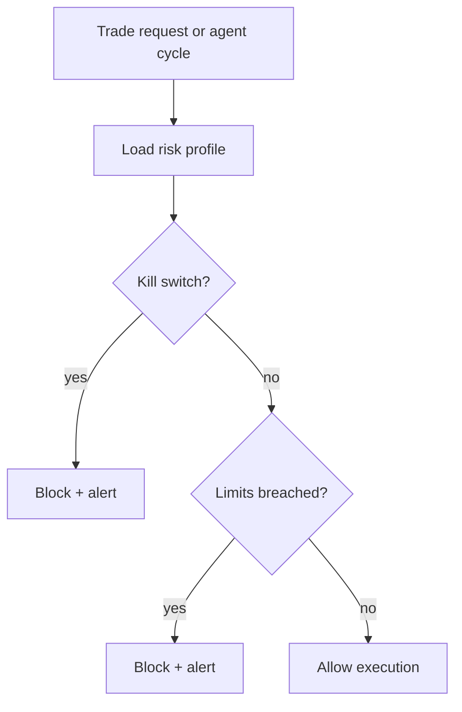
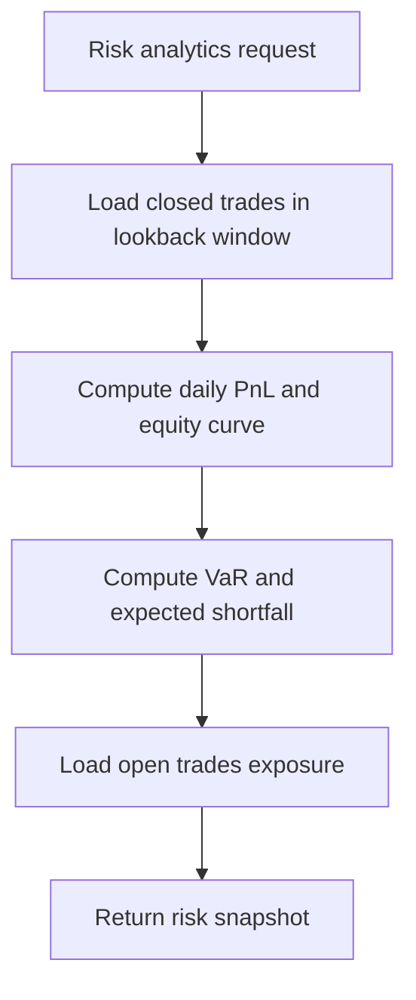
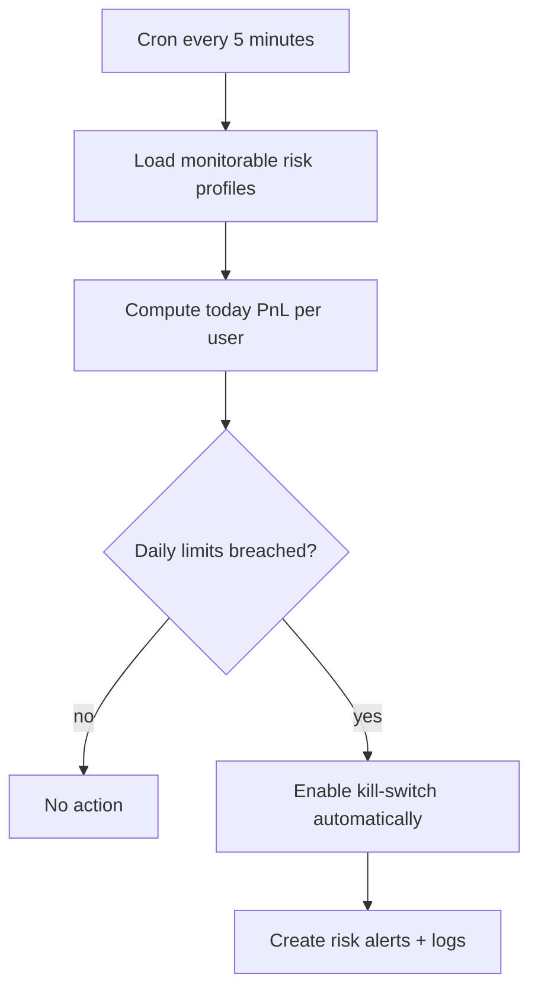

# Risk Module (v1.5)

Risk module centralizes user-level trading guardrails and breach alerts.

## Features

- User risk profile:
  - kill switch
  - max position value per trade
  - max daily loss
  - max daily profit
  - max open trades per agent
- Risk alerts for breach events
- API for profile updates and kill-switch controls
- Risk analytics snapshot (historical VaR + drawdown + exposure)
- Scheduled auto kill-switch worker for daily PnL breaches

## API

- `GET /api/v1/risk/profile`
- `PATCH /api/v1/risk/profile`
- `POST /api/v1/risk/kill-switch/enable`
- `POST /api/v1/risk/kill-switch/disable`
- `GET /api/v1/risk/alerts`
- `GET /api/v1/risk/analytics?days=30&confidenceLevel=95`

## Integration points

- `TradeExecutor.executeTrade` calls `evaluateTradeRisk`.
- `AgentProcessor` calls `evaluateDailyPnL`.

## Flow

## Analytics flow

## Auto kill-switch flow

## Scheduler configuration

- `RISK_AUTO_KILL_SWITCH_ENABLED` (default: `true`)
- `RISK_AUTO_KILL_SWITCH_BATCH_SIZE` (default: `200`, min: 1, max: 1000)
