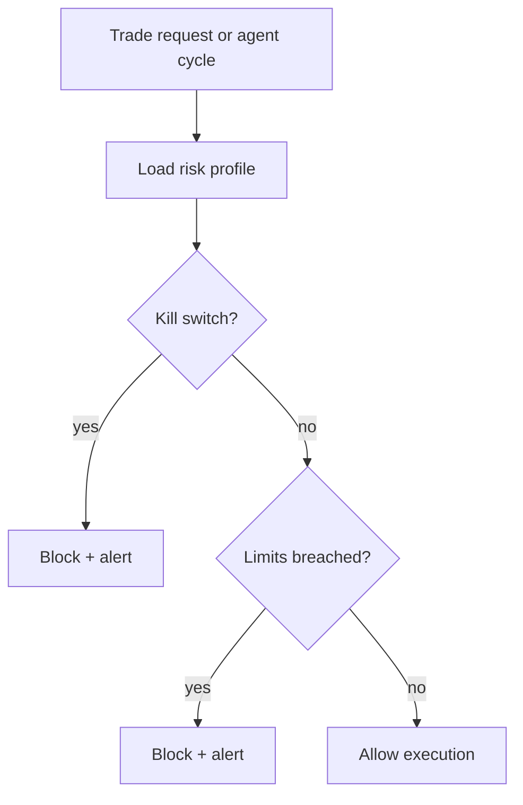

# Risk Module (v1)

Risk module centralizes user-level trading guardrails and breach alerts.

## Features

- User risk profile:
  - kill switch
  - max position value per trade
  - max daily loss
  - max daily profit
  - max open trades per agent
- Risk alerts for breach events
- API for profile updates and kill-switch controls

## API

- `GET /api/v1/risk/profile`
- `PATCH /api/v1/risk/profile`
- `POST /api/v1/risk/kill-switch/enable`
- `POST /api/v1/risk/kill-switch/disable`
- `GET /api/v1/risk/alerts`

## Integration points

- `TradeExecutor.executeTrade` calls `evaluateTradeRisk`.
- `AgentProcessor` calls `evaluateDailyPnL`.

## Flow

