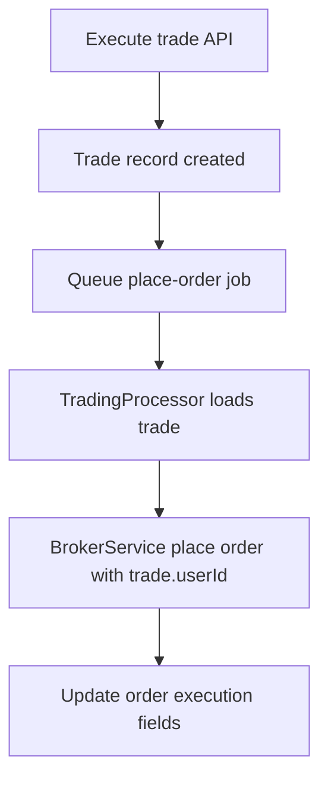

# Trading Module

Trading module handles trade lifecycle APIs and background order execution.

## Hardening done

1. **DTO validation**
   - `ExecuteTradeDto`
   - `CloseTradeDto`
2. **User scoping**
   - `GET /trades/:id` now resolves by `id + userId`
   - `GET /trades/agent/:agentId` filtered by current user
   - `POST /trades/:id/close` verifies trade ownership before queuing close
3. **Broker call safety**
   - Queue processor resolves trade first, then uses trade owner identity for broker order placement

## Execution flow (simplified)

## Remaining next-step improvements

- Fill reconciliation from broker orderbook/tradebook for exact execution prices
- Idempotency keys for duplicate job protection
- Side-aware realized/unrealized P&L consistency checks
