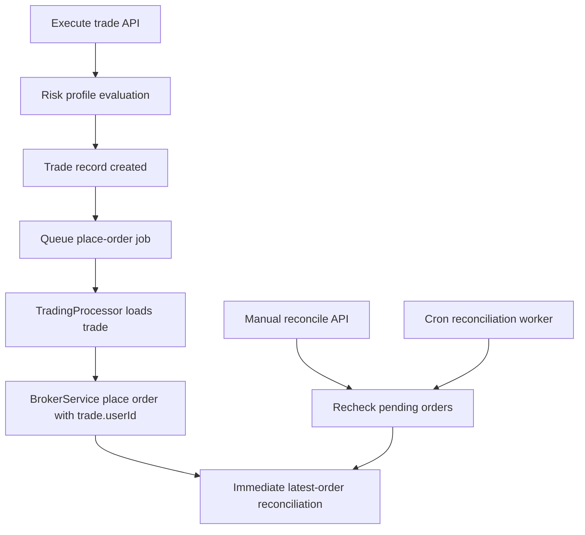

# Trading Module

Trading module handles trade lifecycle APIs, queued broker execution, and order reconciliation.

## Hardening done

1. **DTO validation**
   - `ExecuteTradeDto`
   - `CloseTradeDto`
   - `ReconcileTradesDto`
2. **User scoping**
   - `GET /trades/:id` now resolves by `id + userId`
   - `GET /trades/agent/:agentId` filtered by current user
   - `POST /trades/:id/close` verifies trade ownership before queuing close
   - `POST /trades/reconcile` reconciles only current user trades
3. **Broker call safety**
   - Queue processor resolves trade first, then uses trade owner identity for broker order placement
4. **Risk controls**
   - Trade execution path is blocked when risk profile kill-switch/limits are breached
5. **Order reconciliation**
   - Queue processor does latest-order-state reconciliation right after placement.
   - API endpoint `POST /trades/reconcile` allows manual reconciliation for pending orders.
   - Scheduled reconciliation worker runs every minute for pending broker orders.

## Execution flow (simplified)

## Remaining next-step improvements

- Continuous tradebook stream reconciliation for partial fills and multi-fill averaging
- Exchange/session-aware re-reconciliation scheduling
- Side-aware realized/unrealized P&L consistency checks for complex exits

## Reconciliation scheduler configuration

- `TRADING_AUTO_RECONCILIATION_ENABLED` (default: `true`)
- `TRADING_AUTO_RECONCILIATION_BATCH_SIZE` (default: `100`, min: 1, max: 500)
