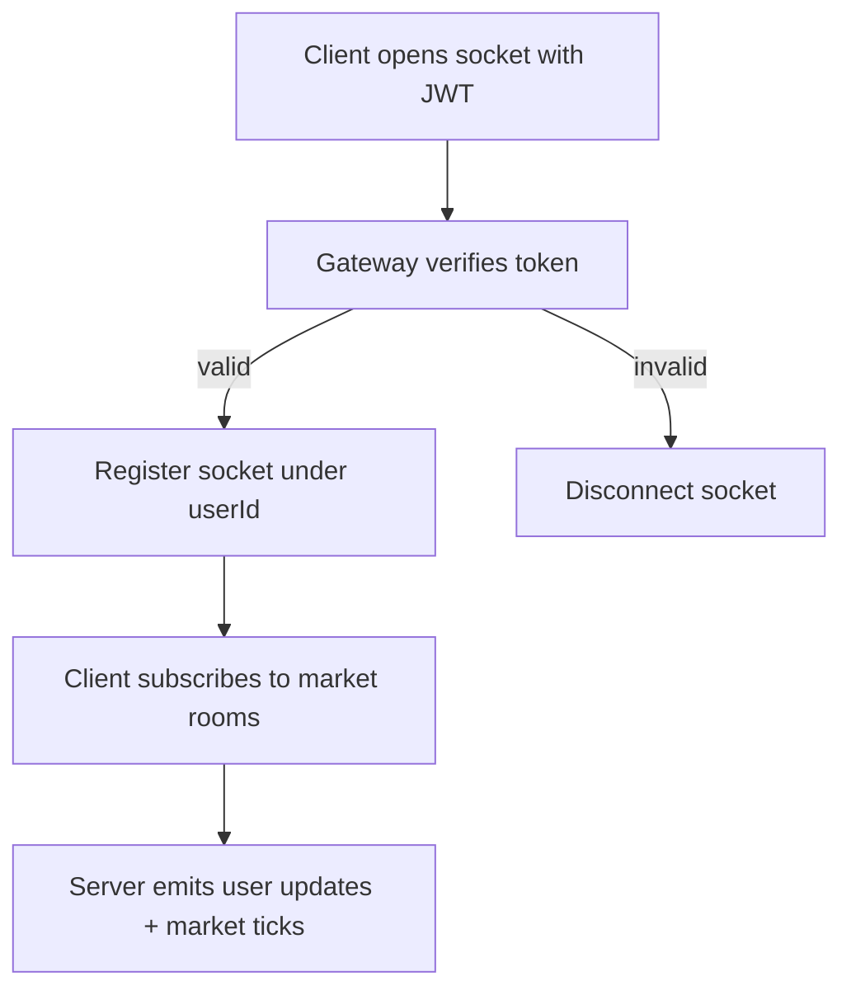

# WebSocket Module

This module powers real-time client updates (agent, trade, portfolio, notifications).

## Authentication model

- Socket authentication is now done at connection handshake using JWT.
- Supported token sources:
  - `handshake.auth.token`
  - `handshake.query.token`
  - `Authorization` header (`Bearer ...`)
- Invalid/missing tokens are rejected and socket is disconnected.
- Socket-user mapping is derived from verified JWT payload (`sub`) only.

## Event flow

## Important behavior

- `authenticate` event is kept for compatibility but ignores caller-provided `userId`.
- User socket cleanup is performed on disconnect.
- All server-side emit helpers (`emitTradeUpdate`, `emitAgentUpdate`, etc.) target authenticated user sockets only.
